# POS Simulator Flutter

## Screenshots

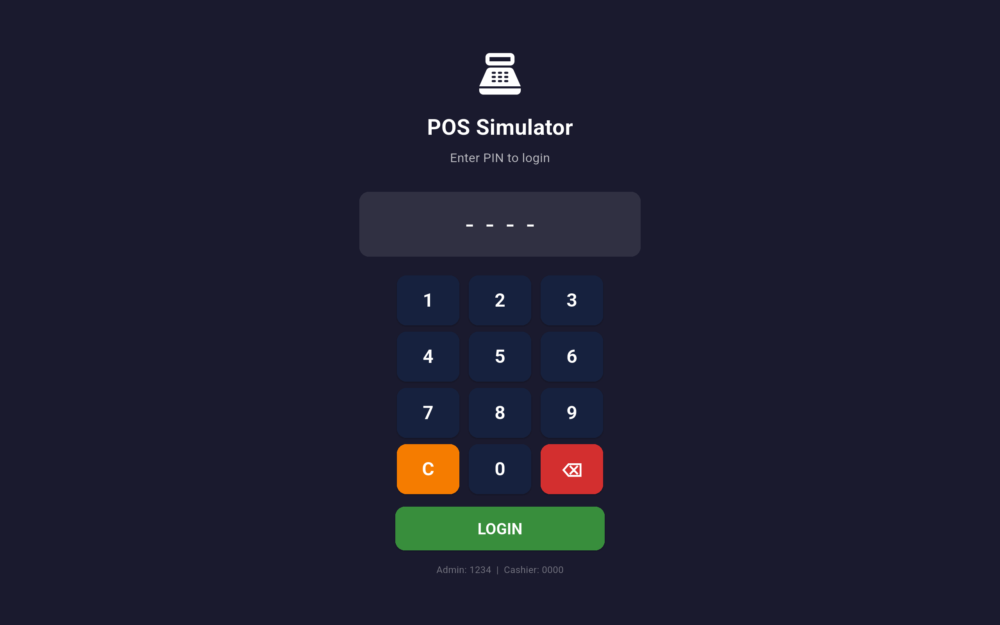
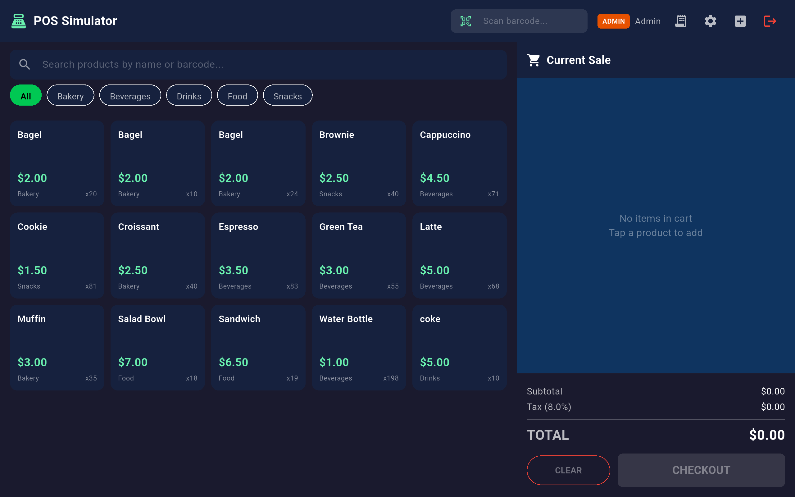
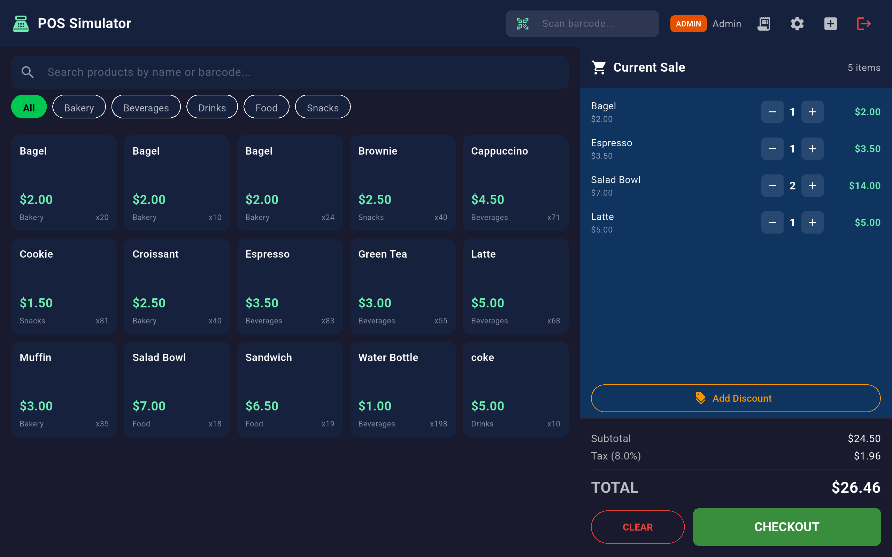
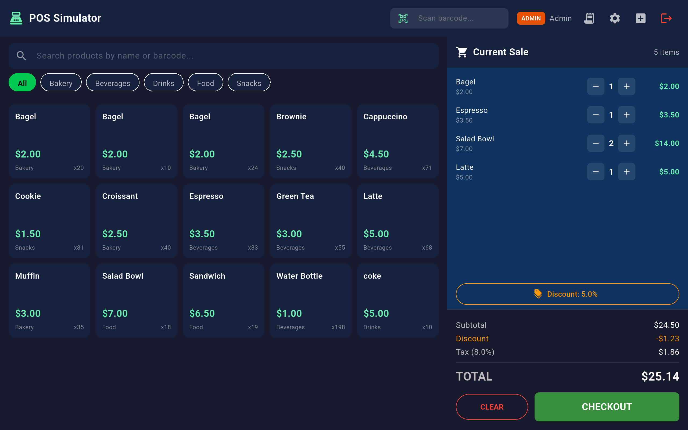
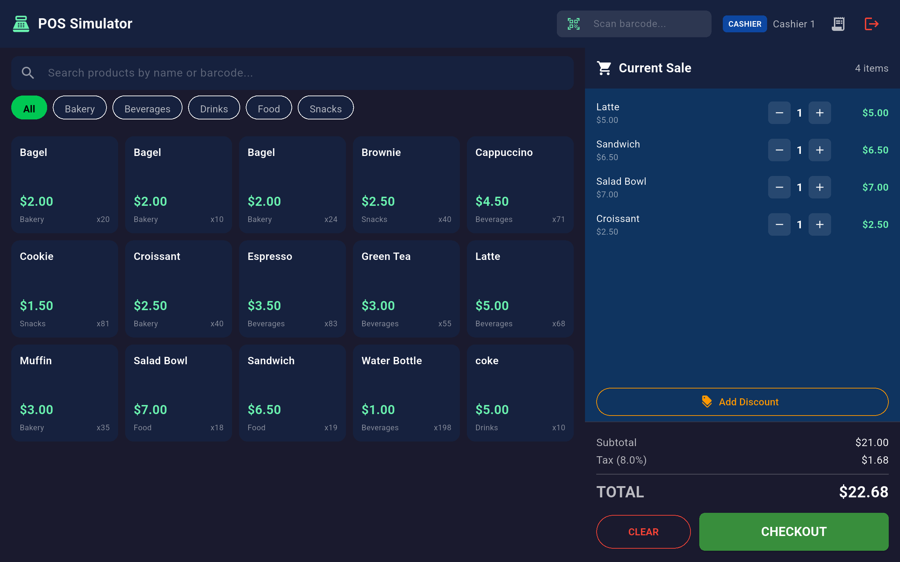
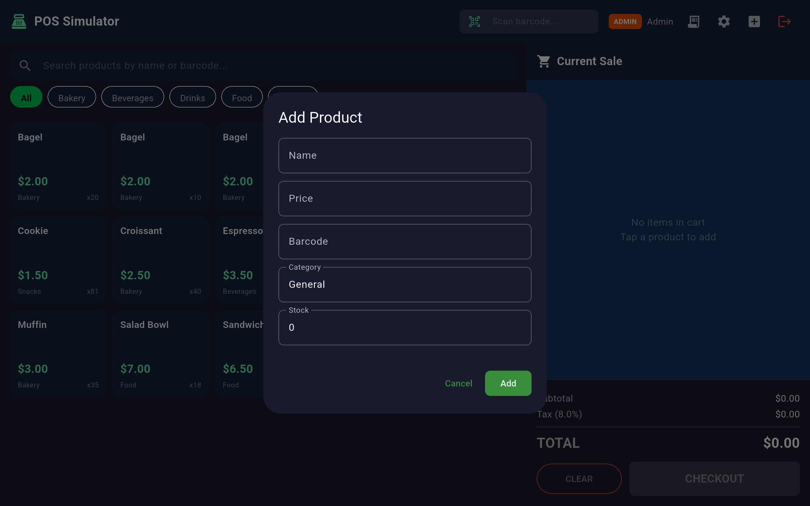
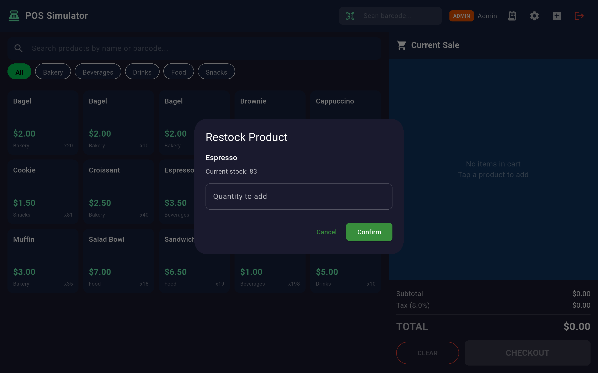
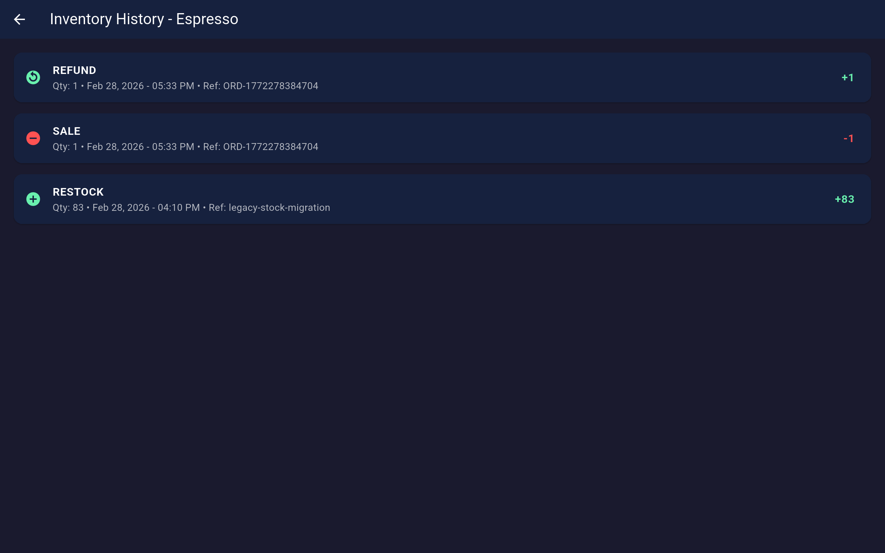
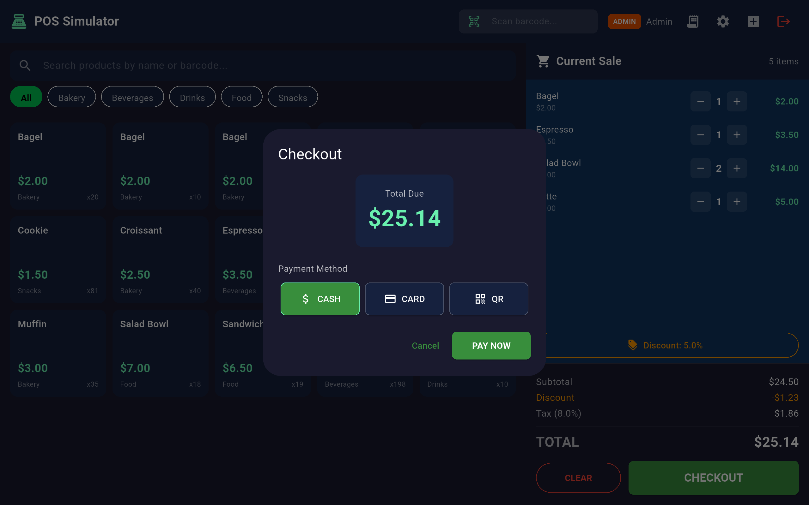
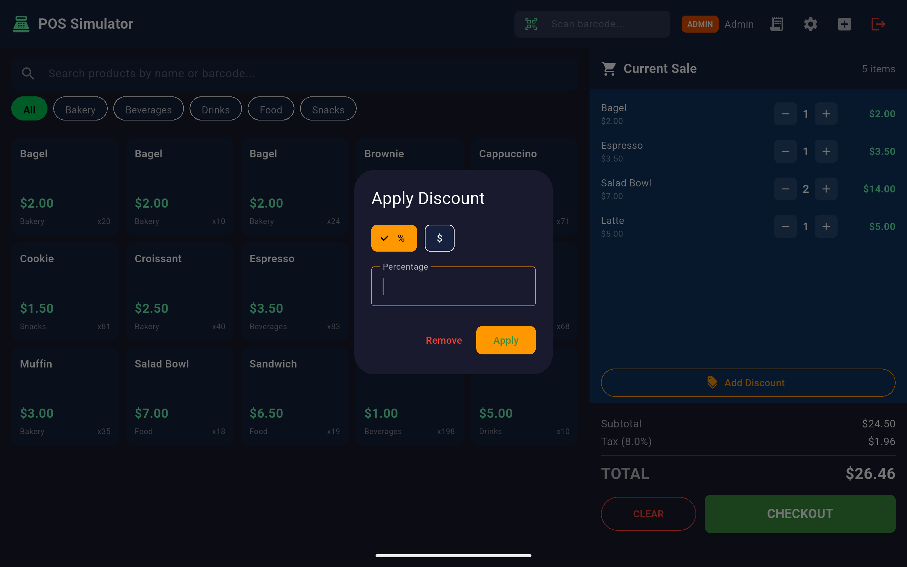
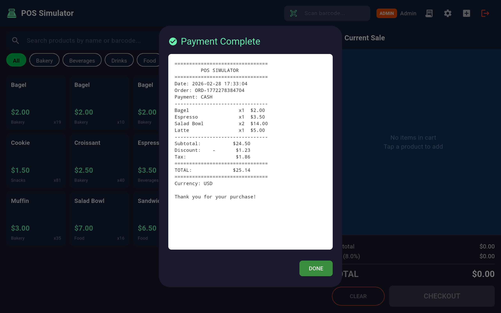
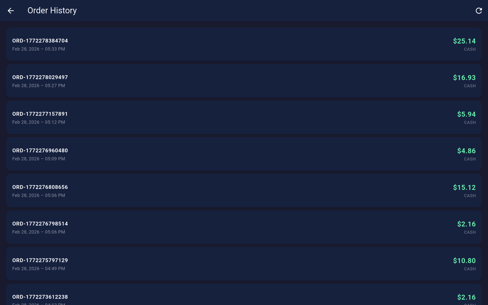
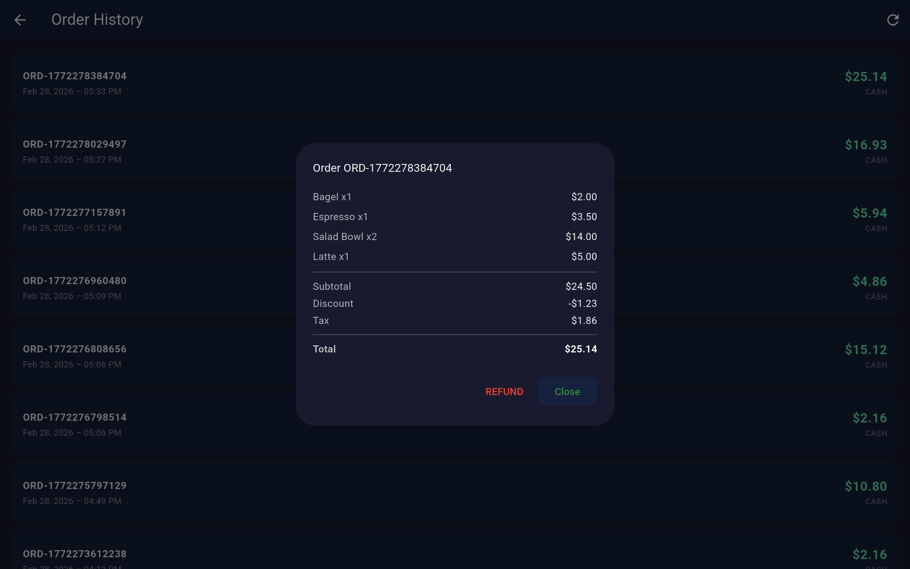
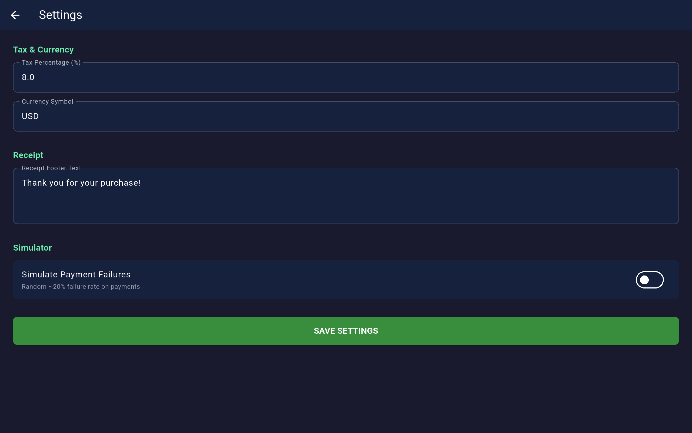

## Short Professional Description

Production-grade Flutter Point of Sale (POS) simulator built with offline-first architecture, Riverpod state management, and transaction-based inventory accounting.

## Overview

This project is a simulator-first POS system designed to reflect real-world retail workflows while remaining fully local and deterministic for development and testing.

The application provides:
- PIN-based role access (`Admin` and `Cashier`)
- Product catalog, barcode scan simulation, and cart operations
- Checkout with payment simulation, receipt preview, and cash drawer simulation
- Order history with refund flow
- Inventory history and admin restock controls
- Persistent local storage using SQLite (`sqflite`)

The business-critical inventory logic follows an immutable transaction ledger model where stock is derived from events rather than directly edited values.

## Key Features

- Offline-first local persistence using SQLite with seeded startup data
- Riverpod-driven reactive state updates across auth, products, cart, settings, inventory, and orders
- Clean architecture separation across `domain`, `data`, and `presentation` in each feature module
- Role-based access control for admin-only operations (settings, add product, restock)
- Inventory transaction ledger with `SALE`, `RESTOCK`, and `REFUND` events
- Refund-safe inventory reversal from order history
- Hardware abstraction layer with swappable printer, scanner, payment terminal, and cash drawer services
- Simulator-ready mock hardware implementations for integration testing without physical devices
- Receipt generation and preview after successful checkout

## Architecture Explanation

The codebase follows a modular feature-first clean architecture pattern:

- **Presentation layer**
	- Flutter widgets/screens + Riverpod providers/notifiers
	- Handles UI events, state rendering, and user interaction
	- Examples: POS screen, checkout dialog, order history, settings

- **Domain layer**
	- Core business entities and pure business rules
	- Examples: `Product`, `CartState`, `Order`, `InventoryTransaction`, `User`
	- Cart totals, tax, and discount calculations are pure and testable

- **Data layer**
	- Repositories encapsulating SQL/database interaction and transactional writes
	- Examples: `ProductRepository`, `OrderRepository`, `InventoryRepository`, `AuthRepository`, `SettingsRepository`

- **Infrastructure/core layer**
	- Database bootstrap/migrations
	- Hardware service contracts and mock implementations
	- Utilities (ID generation, currency formatting, app config)

### State Management (Riverpod)

The app uses `flutter_riverpod` for predictable, reactive state flow:
- `StateNotifierProvider` for auth/cart/settings state
- `AsyncNotifierProvider` for async product/inventory operations
- `FutureProvider` for query-driven data (orders list, inventory history)
- Provider invalidation to refresh dependent views after mutations (checkout, refund, restock)

### UI and Business Logic Separation

Screens and dialogs delegate persistence and business workflows to repositories/notifiers. Critical actions (checkout, stock validation, refund, restock) are handled in data/business layers, keeping UI components focused on orchestration and feedback.

## Inventory Transaction System Explanation

Inventory is modeled as an append-only transaction log.

### Transaction Model

`InventoryTransaction` includes:
- `id`
- `productId`
- `type` (`sale`, `restock`, `refund`)
- `quantity` (positive integer)
- `createdAt`
- `referenceId` (optional order/reference link)

### Stock Derivation

Stock is computed by SQL aggregation over `inventory_transactions`:
- `sale` => subtract quantity
- `restock` => add quantity
- `refund` => add quantity

This means stock is always derived from history, not directly mutated.

### Business Guarantees

- `ensureCanSell` validates available stock before order creation
- Order creation and inventory deductions occur inside a single DB transaction
- Refund operation appends `refund` transactions and marks order status as `refunded`
- Product stock shown in UI is an aggregated computed field from ledger data

### Migration Strategy

Database version upgrade to v2 introduces `inventory_transactions` and migrates legacy product stock into restock seed transactions to preserve history consistency.

## Hardware Abstraction Layer Explanation

Hardware capabilities are abstracted behind interfaces in `core/services`:

- `PrinterService`
- `ScannerService`
- `PaymentService`
- `DrawerService`

Mock implementations in `core/services/mock` provide simulator behavior:
- Simulated payment processing with optional failure mode
- Scanner stream from manual input
- Printer output logging and receipt simulation
- Drawer open/close state stream with auto-close behavior

This design allows replacing mocks with real device adapters (USB/Bluetooth/SDK-based) without changing feature business logic.

## Offline-First Design

The app is designed to run fully offline:

- All operational data is persisted locally in SQLite
- Core workflows (login, sales, inventory, refunds, settings) require no network connection
- Repositories query local tables directly
- Seed data enables immediate startup usage in local-only environments
- Deterministic local simulator behavior supports QA and demo scenarios

## Project Structure

```text
pos_simulator_flutter/
├─ lib/
│  ├─ main.dart
│  ├─ core/
│  │  ├─ config/
│  │  │  └─ app_config.dart
│  │  ├─ database/
│  │  │  └─ database_helper.dart
│  │  ├─ services/
│  │  │  ├─ printer_service.dart
│  │  │  ├─ scanner_service.dart
│  │  │  ├─ payment_service.dart
│  │  │  ├─ drawer_service.dart
│  │  │  └─ mock/
│  │  │     ├─ mock_printer_service.dart
│  │  │     ├─ mock_scanner_service.dart
│  │  │     ├─ mock_payment_service.dart
│  │  │     └─ mock_drawer_service.dart
│  │  └─ utils/
│  │     ├─ id_generator.dart
│  │     └─ currency_formatter.dart
│  └─ features/
│     ├─ auth/
│     │  ├─ data/
│     │  ├─ domain/
│     │  └─ presentation/
│     ├─ products/
│     │  ├─ data/
│     │  ├─ domain/
│     │  └─ presentation/
│     ├─ cart/
│     │  ├─ domain/
│     │  └─ presentation/
│     ├─ inventory/
│     │  ├─ data/
│     │  ├─ domain/
│     │  └─ presentation/
│     ├─ orders/
│     │  ├─ data/
│     │  ├─ domain/
│     │  └─ presentation/
│     ├─ payments/
│     │  └─ presentation/
│     ├─ pos/
│     │  └─ presentation/
│     └─ settings/
│        ├─ data/
│        └─ presentation/
├─ screenshots/
├─ test/
├─ pubspec.yaml
└─ README.md
```

## How to Run

### Prerequisites

- Flutter SDK (stable)
- Dart SDK (compatible with project constraint)
- A target device/emulator (Android/iOS/Desktop/Web)

### Install Dependencies

```bash
flutter pub get
```

### Run the App

```bash
flutter run
```

### Default Login Credentials

- Admin PIN: `1234`
- Cashier PIN: `0000`

### Optional

- Analyze code:

```bash
flutter analyze
```

- Run tests:

```bash
flutter test
```

## Future Enhancements

- Replace mock hardware services with real POS device integrations (ESC/POS printer, barcode scanner, payment terminal, cash drawer)
- Add shift management and cashier session reconciliation
- Add end-of-day sales reports and export (CSV/PDF)
- Introduce multi-store support and local sync queue for eventual cloud replication
- Add advanced role permissions and audit trails for sensitive operations
- Add receipt template customization with logo and tax profile presets
- Expand automated test coverage for repository and business rule layers

## License

License to be defined.
